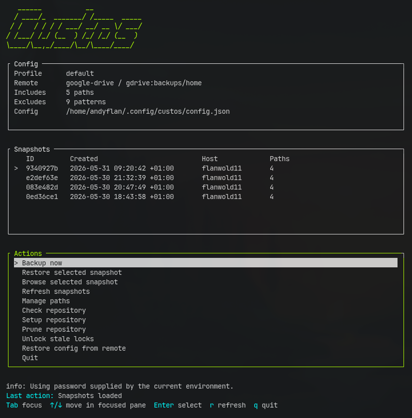

# Custos

```text
   ______           __             
  / ____/_  _______/ /_____  _____
 / /   / / / / ___/ __/ __ \/ ___/
/ /___/ /_/ (__  ) /_/ /_/ (__  ) 
\____/\__,_/____/\__/\____/____/  
```

`custos` is a shell-first backup and restore tool for Linux home directories.
It uses `restic` for encrypted deduplicated backups and `rclone` for remote storage.

The first supported remote adapter is Google Drive.

## Status

This repository is in the first shell milestone. The CLI backup engine is usable,
and the TUI is a shell-rendered dashboard over the same commands.

## Requirements

- `bash`
- `jq`
- `restic`
- `rclone`

Install missing packages with the package manager for your distribution:

```bash
# Arch / Manjaro
sudo pacman -S --needed jq restic rclone

# Debian / Ubuntu
sudo apt-get update
sudo apt-get install jq restic rclone

# Fedora / RHEL family
sudo dnf install jq restic rclone
```

## Install

Install from GitHub:

```bash
curl -fsSL https://raw.githubusercontent.com/inheritweb/custos/main/scripts/install.sh | bash
```

The installer places project files in:

```txt
~/.local/share/custos
```

and installs the command wrapper at:

```txt
~/.local/bin/custos
```

For a VM test against a branch or commit:

```bash
curl -fsSL https://raw.githubusercontent.com/inheritweb/custos/main/scripts/install.sh | bash -s -- --ref <branch-or-sha>
```

The installer only installs the Custos files and command wrapper. Install
dependencies separately with your distribution's package manager.

Uninstall the local app files, command wrapper, config, and state:

```bash
custos uninstall
```

This keeps rclone configuration and remote backup data. To leave local config and state behind:

```bash
custos uninstall --keep-local-data
```

## Interactive TUI

Launch the interactive terminal UI:

```bash
custos
```



The TUI is a shell frontend over the same commands documented below. It uses a
static dashboard layout: config, snapshots, and actions stay visible while focus
moves between the snapshots and actions panes with Tab.

On first run, the actions pane lets you connect Google Drive, restore an existing
config, or create a new config. Once configured, snapshots stay visible alongside
backup, restore, path, repository, and maintenance actions.

If no stored password command is available, the TUI asks for the repository
password once at session start and reuses it for repository actions. Passwords
are passed through the process environment, not as command-line arguments.

## Journeys

### First Backup On This Machine

Install dependencies:

```bash
# Arch / Manjaro
sudo pacman -S --needed jq restic rclone

# Debian / Ubuntu
sudo apt-get update
sudo apt-get install jq restic rclone

# Fedora / RHEL family
sudo dnf install jq restic rclone
```

Check the local environment:

```bash
custos doctor
```

Create or inspect the config:

```bash
custos config show
custos paths list
```

Set up Google Drive and initialize the Restic repository:

```bash
custos setup
```

Preview and run the first backup:

```bash
custos backup --dry-run
custos backup
```

Verify it:

```bash
custos snapshots
custos check
```

### Restore A File Safely

By default, restore goes to a staging directory so local files are not overwritten:

```bash
custos restore latest ~/Documents/file.pdf
```

The default target is:

```txt
~/Restored/custos/latest
```

Restore to the original location only when that is intentional:

```bash
custos restore latest ~/Documents/file.pdf --original
```

### Fresh Linux Restore

On a newly installed machine, install dependencies and configure Google Drive:

```bash
# Arch / Manjaro
sudo pacman -S --needed jq restic rclone

# Debian / Ubuntu
sudo apt-get update
sudo apt-get install jq restic rclone

# Fedora / RHEL family
sudo dnf install jq restic rclone

custos remote setup
```

Restore the saved `custos` config from the remote:

```bash
custos config restore
```

Then inspect snapshots and restore to a staging directory:

```bash
custos snapshots
custos restore latest --target ~/Restored/custos/latest
```

Use `--original` only when you want Restic to write back to the original paths.

### Change What Gets Backed Up

List the active include and exclude rules:

```bash
custos paths list
```

Add or remove protected paths:

```bash
custos paths include add ~/Projects
custos paths include remove ~/Projects
```

Add or remove exclude patterns:

```bash
custos paths exclude add '**/*.qcow2'
custos paths exclude remove '**/*.qcow2'
```

Preview before running the next backup:

```bash
custos backup --dry-run
```

### Interrupted Or Failed Backup

It is safe to stop a running backup with `Ctrl+C`. Restic may leave unreferenced
uploaded chunks, but incomplete snapshots are not useful restore points.

After fixing includes/excludes, rerun:

```bash
custos backup
```

Once you have a successful snapshot, reclaim unreferenced repository data:

```bash
custos prune
```

## Quick Start

Run the CLI from the repository:

```bash
custos doctor
custos config show
custos config validate
```

The first config command creates:

```txt
~/.config/custos/config.json
```

Set up Google Drive storage and initialize the restic repository:

```bash
custos setup
```

Password handling follows this order:

1. If `secrets.passwordCommand` is configured, `custos` uses it.
2. If the TUI asks for a password, it passes it to the backend environment for that action.
3. Otherwise, commands ask for the repository password when needed.

Avoid passing literal passwords as command-line arguments because they can leak
through shell history or process listings.

Create a backup:

```bash
custos backup
```

List snapshots:

```bash
custos snapshots
```

Restore a snapshot to a staging directory:

```bash
custos restore latest --target ~/Restored/custos/latest
```

Restore a selected path from a snapshot:

```bash
custos restore latest ~/Documents --target ~/Restored/custos/latest
```

## Commands

```bash
custos init
custos setup
custos
custos tui
custos backup [--dry-run]
custos snapshots [args...]
custos ls <snapshot> [path]
custos restore <snapshot> [path] [--target <path>|--original] [--dry-run] [--yes]
custos check
custos doctor
custos remote setup
custos remote check
custos password setup
custos password status
custos paths list
custos paths include add <path>
custos paths include remove <path>
custos paths exclude add <pattern>
custos paths exclude remove <pattern>
custos forget [--dry-run]
custos prune
custos unlock
custos status
custos config show
custos config validate
custos config edit
custos config restore [--repository <url>] [--yes]
```

## Tests

Run the shell test suite with:

```bash
./tests/run.sh
```

The tests use fake `restic` and `rclone` commands, so they do not access a real
repository or remote storage.

## Configuration

See [examples/config.google-drive.json](examples/config.google-drive.json).

The default config backs up common personal data paths and excludes generated
directories such as `node_modules`, `.next`, `dist`, caches, Python virtualenvs,
Rust targets, and ISO images.

Every backup also stores a sanitized copy of the `custos` config next to
the Restic repository on the remote at:

```txt
/.custos/config.json
```

This bootstrap config is copied with `rclone`, not Restic, so it can be restored
before the Restic repository password is available. The `secrets` section is
removed from that remote copy.

On a fresh Linux install, restore that config before normal setup:

```bash
custos config restore
```

By default this looks at:

```txt
rclone:gdrive:backups/home
```

You can override it:

```bash
custos config restore --repository rclone:gdrive:backups/laptop
```

Customize protected paths through the CLI:

```bash
custos paths list
custos paths include add ~/Projects
custos paths exclude add '**/coverage'
custos paths include remove ~/Projects
custos paths exclude remove '**/coverage'
```

## Safety

Restore defaults to a staging directory under:

```txt
~/Restored/custos/<snapshot>
```

Restoring to original locations requires `--original` and prints a warning before
continuing.

## Acknowledgements

The TUI look, feel, and interaction model are inspired by
[Impala](https://github.com/pythops/impala), especially its static pane layout,
focused-border navigation, and modal prompts.
